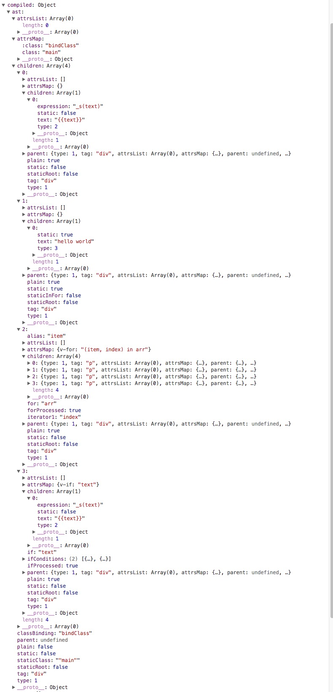

## 编译

``` html
<div class="main" :class="bindClass">
    <div>{{text}}</div>
    <div>hello world</div>
    <div v-for="(item, index) in arr">
        <p>{{item.name}}</p>
        <p>{{item.value}}</p>
        <p>{{index}}</p>
        <p>---</p>
    </div>
    <div v-if="text">
        {{text}}
    </div>
    <div v-else></div>
</div>
```

- 转换`AST`

  

- 由 `AST` 得到的 `render` 函数

  ``` javascript 
  with(this){
    return _c(  'div',
      {
        /*static class*/
        staticClass:"main",
        /*bind class*/
        class:bindClass
      },
      [
        _c( 'div', [_v(_s(text))]),
        _c('div',[_v("hello world")]),
        /*这是一个v-for循环*/
        _l(
          (arr),
          function(item,index){
            return _c('div',
                      [_c('p',[_v(_s(item.name))]),
                      _c('p',[_v(_s(item.value))]),
                      _c('p',[_v(_s(index))]),
                      _c('p',[_v("---")])]
                    )
          }
        ),
        /*这是v-if*/
        (text)?_c('div',[_v(_s(text))]):_c('div',[_v("no text")])
      ],
      2
    )
  }
  ```